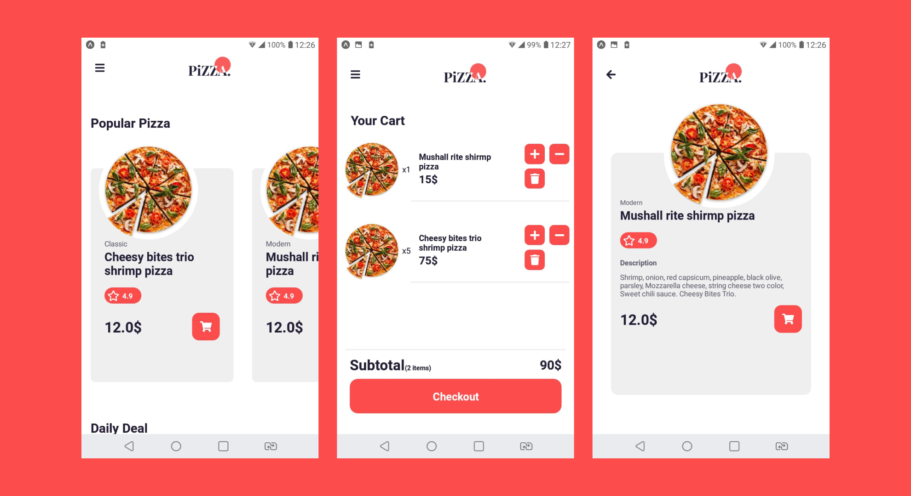

<h1 align="center">
	
</h1>

<h3 align="center">
  UI-Pizzeria
</h3>

<p align="center">Mobile application to make your life easier when ordering a pizza</p>

<p align="center">  
  
</p>

<p align="center">
  <a href="#technologies">Technologies</a>&nbsp;&nbsp;&nbsp;|&nbsp;&nbsp;&nbsp;
  <a href="#getting-started">Getting started</a>&nbsp;&nbsp;&nbsp;|&nbsp;&nbsp;&nbsp;
  <a href="#license">License</a>
</p>

<h1 align="center">
	
</h1>

## Technologies

Technologies that I used to develop this mobile client

- [React Native](https://reactnative.dev/)
- [React Navigation](https://reactnavigation.org/)
- [Redux](https://redux.js.org/)
- [Styled Components](https://styled-components.com/)
- [TypeScript](https://www.typescriptlang.org/)

## Getting started

**Clone the project and access the folder**

```bash
$ git clone https://github.com/hugosrc/ui-pizza-app.git && cd ui-pizza-app
```

**Follow the steps below**

```bash
# Install the dependencies
$ yarn

# If you are going to emulate with android, run this command
# Be sure to have the emulator open
$ yarn android

# If you are going to emulate with ios, run this command
$ yarn ios

# If you want to use the expo application, run this command.
$ expo start
```

## License

This project is licensed under the MIT License - see the [LICENSE](LICENSE) file for details.

---

Made by Hugo Souza